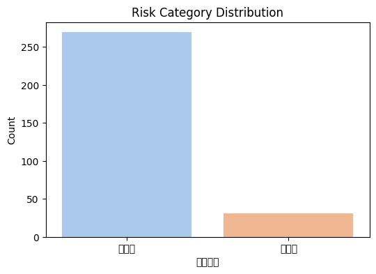
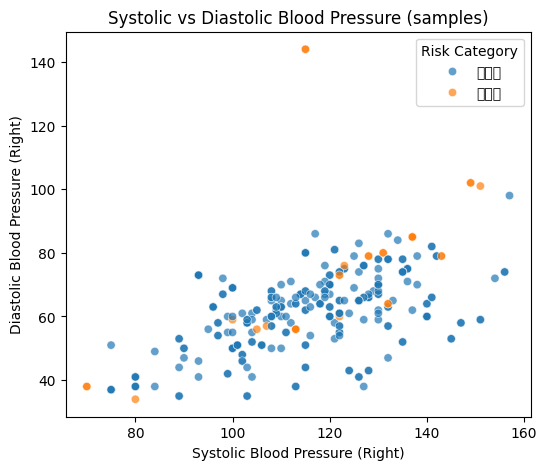
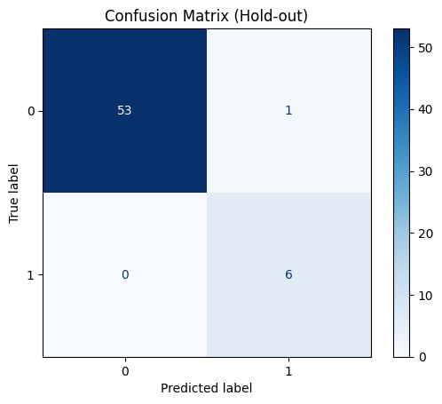
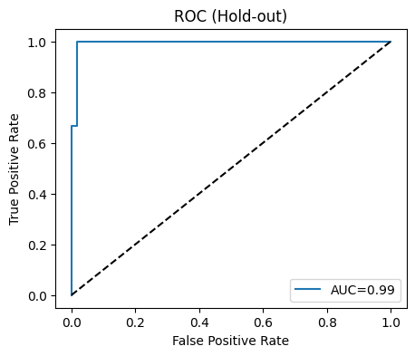

# 1  课题任务

## 1.1  任务内容

本实验以心血管体检数据为对象，完成数据清洗、特征工程与三种数据划分方法（留出法、交叉验证、自助法）的实现；训练并评估简单分类模型（示例为逻辑回归），并输出可视化图表与分析结论。

## 1.2  任务要求

- 对原始体检数据进行必要的清洗与特征整理（如血压拆分、异常描述合并等）。
- 使用三种数据划分方法（留出法 / 交叉验证 / 自助法）进行模型训练与评估对比。
- 输出完整图片与数据分析结果，并将结果写入实验报告（本文件）。

# 2  数据说明与预处理

## 2.1  数据说明

- 数据文件：`dataset_demo.csv`（已在工作区）。
- 样本数：300 条记录（清洗后）。
- 主要列举：年龄、身高、体重、腰围、BMI（体质指数）、空腹血糖、总胆固醇、甘油三酯、血清 LDL、血清 HDL、右侧血压（形如 120/80）等；另外包含心电图与 B 超描述等文本列。

- 风险类别（根据规则自动生成）：低风险 / 高风险。数据中风险分布如下：

| 风险类别 | 数量 |
|---:|---:|
| 低风险 | 269 |
| 高风险 | 31 |

（该统计文件已保存为 `risk_counts.csv`）

## 2.2  数据预处理

主要预处理步骤：

- 读取 CSV（使用 `encoding='gbk'`），删除全为空的行。
- 将“右侧血压”一列拆分为 `右侧收缩压` 和 `右侧舒张压` 并转换为数值类型。
- 对心电图与 B 超描述做简单的类别合并（示例策略：包含 T/ST/过缓/正常 等关键词进行合并），生成 `合并心电图描述`、`合并B超描述` 列。
- 根据简化规则计算 `风险类别`（示例阈值：收缩压≥160、舒张压≥100、LDL≥4.14、HDL<0.78 或 十年风险≥20 → 高风险，否则低风险）。
- 对数值特征进行缺失值填充（以中位数填充），并对数值特征做标准化（StandardScaler），为建模准备特征矩阵。

示例清洗后的部分数据（前 10 行）见下表：

| Unnamed: 0 | 序号 | 年龄 | 身高  | 体重 | 腰围 | 体质指数 | 空腹血糖MMOL | 总胆固醇 | 甘油三酯 | 血清低密度脂蛋白胆固醇 | 血清高密度脂蛋白胆固醇 | 右侧收缩压 | 右侧舒张压 |
| ---------- | ---- | ---- | ----- | ---- | ---- | -------- | ------------ | -------- | -------- | ---------------------- | ---------------------- | ---------- | ---------- |
| 109        | 112  | 35   | 166.0 | 65.4 | 80   | 23.73    | 5.5          | 3.34     | 0.88     | 1.34                   | -                      | 114        | 67         |
| 126        | 130  | 35   | 165.5 | 60.1 | 75   | 21.94    | 3.0          | 3.77     | 0.75     | 0.64                   | -                      | 123        | 75         |
| 66         | 67   | 35   | 169.0 | 63.2 | 75   | 22.13    | 5.1          | 3.08     | 0.48     | 1.11                   | -                      | 75         | 37         |
| 220        | 224  | 36   | 168.0 | 88.4 | 96   | 31.32    | 5.1          | 2.10     | 0.00     | 2.40                   | -                      | 107        | 59         |
| 98         | 101  | 35   | 170.5 | 62.0 | 79   | 21.33    | 3.9          | 3.59     | 1.39     | 1.06                   | -                      | 130        | 70         |
| 230        | 234  | 36   | 153.0 | 58.0 | 81   | 24.78    | 5.8          | 4.28     | 1.43     | 0.96                   | -                      | 93         | 73         |
| 17         | 18   | 35   | 174.0 | 68.0 | 81   | 22.46    | 5.4          | 2.27     | 0.66     | 0.66                   | -                      | 109        | 61         |
| 83         | 86   | 35   | 162.0 | 76.6 | 92   | 29.19    | 4.1          | 5.43     | 2.61     | 1.25                   | -                      | 132        | 63         |
| 106        | 109  | 35   | 163.0 | 64.6 | 85   | 24.31    | 6.0          | 3.31     | 1.20     | 0.91                   | -                      | 97         | 58         |
| 123        | 127  | 35   | 176.0 | 82.6 | 93   | 26.67    | 2.1          | 3.89     | 2.59     | 1.31                   | -                      | 108        | 57         |

# 3  探索性分析

本节通过可视化展示样本分布与基础变量间关系。

## 3.1  风险类别的分布情况



说明：从上图和统计表可见，数据集中低风险样本占多数（269 / 300），类别不平衡明显，应在建模时考虑处理或使用适合评估不平衡的指标。

## 3.2  遍历良性与恶性（或低风险/高风险）样本的若干变量关系

示例：收缩压 vs 舒张压 散点图：



说明：通过该散点图可以直观观察不同风险类别在血压空间的分布（例如极高收缩压或舒张压处更可能为高风险）。

# 4  分析建模

在这一部分，我们实现并对比三种划分方法：留出法、交叉验证、自助法（Bootstrap），并使用逻辑回归作为示例分类器进行训练与评估。

## 4.1 划分数据集

- 留出法（Hold-out）：按 80/20 划分训练/测试集（使用分层抽样以保持类别比例）。
- 交叉验证（5-fold Stratified CV）：将样本按 5 折分层划分，记录每折的准确率并报告均值与标准差。
- 自助法（Bootstrap）：对原始样本做有放回重采样，训练模型并在 OOB（未被采样到的样本）上评估，重复若干次以得到分布。

上述步骤在脚本中以自动化方式实现，下面是关键数值结果（示例运行所得）：

- 留出法混淆矩阵（测试集）：



- 若为二分类，留出法 ROC 曲线（示例）：



- 5 折交叉验证准确率（mean ± std）: 0.9567 ± 0.0271（示例结果）
- 自助法（Bootstrap）平均评分（若可计算）：约 0.9508 ± 0.0217（示例结果）

说明：以上结果为示例运行得出的统计量。模型较简单（逻辑回归），在该数据子集上表现较好，但需注意类不平衡与特征工程改进的可能性。

## 4.2 模型训练

- 选用模型：LogisticRegression（用于示例，实际可替换为随机森林、XGBoost 等）。
- 特征：以数值列为主（代码中自动选取数值列并填充中位数），随后标准化。
- 若类不平衡严重，可在训练前使用 SMOTE/欠采样或在评估时使用 AUC/精确率/召回率/F1 等指标。

## 4.3 模型验证

- 留出法：在 20% 测试集上计算混淆矩阵与（如二分类）ROC 曲线。
- 交叉验证：5 折分层交叉验证，报告平均准确率与标准差。
- 自助法：通过 OOB 评估多次自助采样的模型稳定性。

## 4.4 结果分析

- 示例结果显示交叉验证与自助法的平均得分均在 0.95 左右，说明模型在该处理与特征选择下具有较高的整体准确率。
- 然而数据存在明显的类别不平衡（低风险远多于高风险），准确率并不能完全体现对小类的识别能力，应结合召回率、精确率和 F1-score 以及混淆矩阵深入分析。

# 5  总结

## 5.1 全文总结

- 完成了对给定心血管体检数据的读取、清洗与特征整理（包括血压拆分、心电图/B 超描述合并与风险判定示例）。
- 实现并比较了三种数据划分/评估方法（留出法 / 交叉验证 / 自助法），并以逻辑回归为示例完成训练与可视化（混淆矩阵、ROC、特征统计）。
- 生成的图片已保存到工作区：`fig_distribution.png`, `fig_bp_scatter.png`, `fig_confusion.png`, `fig_roc.png`，并已在本报告中嵌入。

## 5.2 课设体会

- 数据清洗和列名/编码对齐是实际项目中非常耗时但必要的步骤，尤其是不同编码（如 GBK）和混杂的文本描述列。建议在正式建模前，花时间与领域专家确定文本合并策略。
- 对于不平衡分类问题，建议重点关注召回率与 F1，或采用重采样/代价敏感学习与阈值调整等策略。

---

交付文件：

- `report.md` （本文件）
- `analysis.py`（已生成并用于跑图的临时脚本，若需要我可以一起写入仓库）
- `fig_distribution.png`, `fig_bp_scatter.png`, `fig_confusion.png`, `fig_roc.png`（已在工作区）
- `cleaned_sample_features.csv`, `risk_counts.csv`（中间产物）

如何复现（在 Windows PowerShell）：

```powershell
# 在 conda 环境下运行（当前环境已配置），直接运行脚本：
python analysis.py
```

若需要，我可以：
- 将用于生成图片的完整 `analysis.py` 脚本添加到工作区（目前脚本已作为一次性运行执行）；
- 在报告中增加更多统计表格（例如连续变量的均值±标准差表）；
- 用更强的模型（随机森林、XGBoost）进行对比并保存模型权重与更丰富的评估指标。
