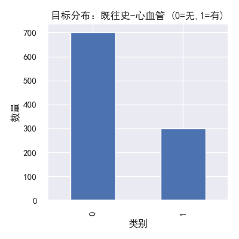
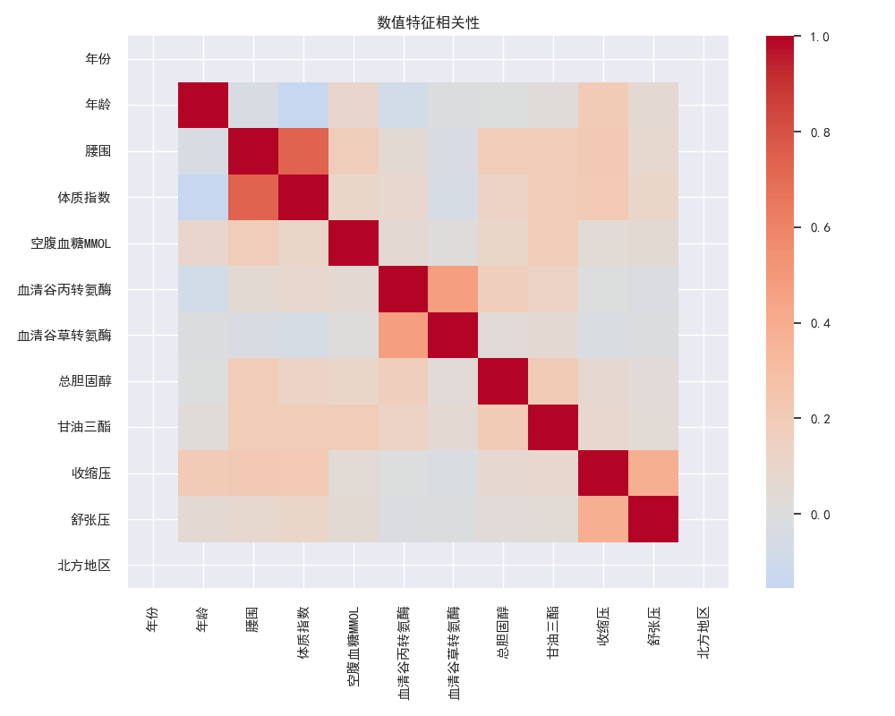
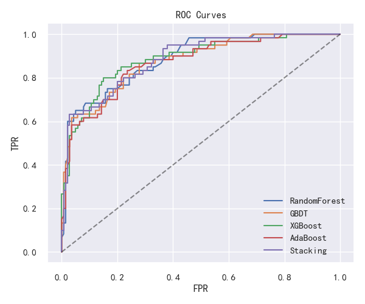
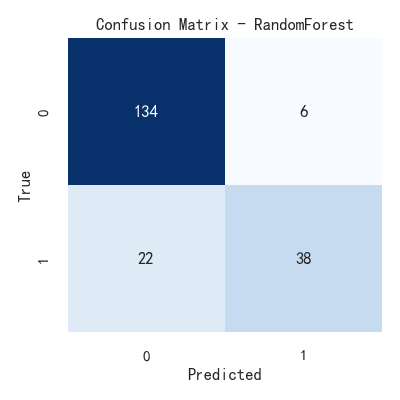

# 实验三：心血管既往史二分类建模报告

> 生成时间：2025-11-05 22:13:54  |  数据文件：心血管既往史抽样数据.csv  |  目标列：`既往史-心血管`

## 1 课题任务

本实验基于体检相关数据，预测个体是否具有“既往史-心血管”。目标为二分类任务（1=有, 0=无）。

## 2 数据说明与预处理

- 原始样本量：1000，特征数：23（去除ID与文本列后用于建模的特征数：21）。

- 目标分布：\n
```
既往史-心血管
0    700
1    300
Name: count, dtype: Int64
```

- 预处理：

  - 数值特征：缺失以中位数填充，随后标准化；

  - 类别特征：缺失以众数填充，One-Hot编码；

  - 丢弃自由文本列（如“疾病描述”）与ID列以避免噪声与泄漏。

## 3 探索性分析

- 目标分布图见下：



- 数值特征相关性热力图：



## 4 分析建模

采用五类模型：随机森林（RF）、GBDT、XGBoost、AdaBoost 与 Stacking。评估指标包括 Accuracy、Precision、Recall、F1、ROC-AUC。


### 4.1 各模型指标

| model        |   train_time_sec |   cv_auc_mean |   cv_auc_std |   accuracy |   precision |   recall |       f1 |   roc_auc |
|:-------------|-----------------:|--------------:|-------------:|-----------:|------------:|---------:|---------:|----------:|
| RandomForest |            0.953 |      0.860621 |    0.0384233 |      0.86  |    0.863636 | 0.633333 | 0.730769 |  0.885298 |
| XGBoost      |            0.854 |      0.840923 |    0.0315228 |      0.82  |    0.730769 | 0.633333 | 0.678571 |  0.884762 |
| Stacking     |           22.96  |    nan        |  nan         |      0.8   |    0.66129  | 0.683333 | 0.672131 |  0.884643 |
| GBDT         |            0.462 |      0.85359  |    0.0294585 |      0.845 |    0.808511 | 0.633333 | 0.71028  |  0.875357 |
| AdaBoost     |            1.418 |      0.855562 |    0.0286024 |      0.835 |    0.8      | 0.6      | 0.685714 |  0.869286 |


### 4.2 ROC曲线与最佳模型混淆矩阵





## 5 总结

- 表现最佳的模型为：**RandomForest**，测试集ROC-AUC=0.885，F1=0.731。

- 核心影响因素可参考特征重要性图（若适用）。

- 可进一步尝试：更精细的特征工程、加入文本特征的NLP表示、SMOTE/类权重调参与更系统的超参数搜索。
