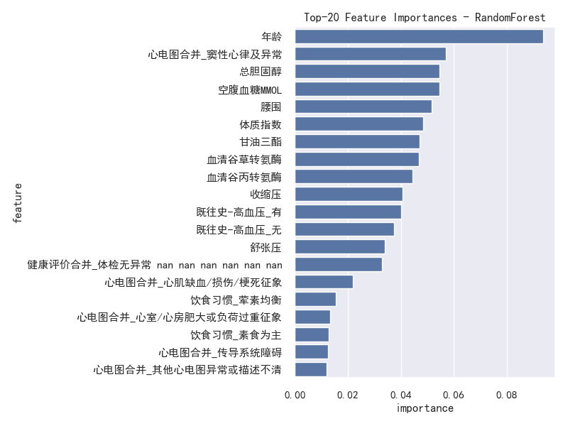

<!-- 说明：Markdown不直接支持“三号黑体/四号黑体”的字号与字体，请在导出到Word后按样式调整；此处用 #/## 近似对应一级/二级标题。-->

# 1  课题任务

## 1.1  任务内容
- 结合体检与既往史相关数据，构建二分类模型预测目标列“既往史-心血管”是否为“有”。
- 在同一套预处理与评估方案下，对以下五类模型进行训练与对比：
  - 随机森林（RandomForest）
  - 梯度提升树（GBDT, GradientBoostingClassifier）
  - XGBoost（XGBClassifier）
  - AdaBoost（AdaBoostClassifier）
  - Stacking（以多基学习器集成为元学习器的堆叠集成）

## 1.2  任务要求
- 完成数据理解、预处理与探索性分析（EDA）。
- 构建规范的训练/验证流程，包含分层划分、统一的预处理Pipeline与交叉验证（CV）。
- 训练并评估五类模型，输出 Accuracy、Precision、Recall、F1、ROC-AUC 等指标与可视化图表（ROC曲线、混淆矩阵、特征重要性等）。
- 输出完整的实验报告，给出方法对比与结果分析，并总结结论与改进方向。

---

# 2  数据说明与预处理

## 2.1  数据说明
- 数据文件：`心血管既往史抽样数据.csv`
- 总样本量：1000
- 目标列：`既往史-心血管`（标签“有/无”已映射为 1/0）
- 用于建模的特征数：21（已剔除ID列`健康档案编号`与自由文本列`疾病描述`）
- 目标分布：

```text
0: 700
1: 300
```

- 示例图表：
  - 目标分布（类别占比）：
  - 数值特征相关性热力图：

## 2.2  数据预处理
- 数值特征：`SimpleImputer(strategy='median')`填补缺失 + `StandardScaler`标准化。
- 类别特征：`SimpleImputer(strategy='most_frequent')`填补缺失 + `OneHotEncoder(handle_unknown='ignore')`独热编码。
- 预处理通过 `ColumnTransformer` 与 `Pipeline` 统一与模型绑定，避免数据泄漏。
- 其他：
  - 将字符串形式的“nan”等无效值替换为缺失。
  - 剔除ID列与自由文本列，降低噪声与防止信息泄露。

---

# 3  探索性分析
- 类别分布：目标类别相对不均衡（约 70% : 30%）。
- 数值变量分布与异常值：参见各特征直方/箱线图（已在Notebook中逐个输出并保存，如`dist_*.png`）。
- 相关性：数值特征之间存在一定线性相关性（详见相关性热力图）。
- 目标对比：部分数值特征随目标（0/1）呈现分布差异（参见 `target_vs_*.png`）。

---

# 4  分析建模

## 4.1 划分数据集
- 采用 `train_test_split(test_size=0.2, stratify=y, random_state=42)` 保持类别分层。
- 划分后：训练集 800 × 21，测试集 200 × 21；训练集目标分布（约 70%/30%）。

## 4.2 模型训练
- 在统一预处理Pipeline基础上训练以下五类模型：
  - RandomForestClassifier（n_estimators=300，class_weight='balanced'）
  - GradientBoostingClassifier（默认参数）
  - XGBClassifier（n_estimators=400, max_depth=4, learning_rate=0.05, subsample=0.9, colsample_bytree=0.9, eval_metric='logloss'）
  - AdaBoostClassifier（n_estimators=300, learning_rate=0.5）
  - StackingClassifier（基学习器：RF/GBDT/(XGB)/Ada；元学习器：LogisticRegression）
- 交叉验证：对单模型在训练集上进行 5 折 `StratifiedKFold` 的 ROC-AUC 评估（Stacking的CV在本轮未单独统计）。

## 4.3 模型验证
- 统一在测试集评估 Accuracy、Precision、Recall、F1、ROC-AUC。
- ROC 曲线：
- 最优模型混淆矩阵（基于 ROC-AUC）：

## 4.4  结果分析
- 指标汇总（测试集表现与训练CV的AUC均值/方差）：

| model        | train_time_sec | cv_auc_mean | cv_auc_std | accuracy | precision | recall | f1    | roc_auc |
|--------------|----------------|-------------|------------|----------|-----------|--------|-------|---------|
| RandomForest | 0.953          | 0.8606      | 0.0384     | 0.860    | 0.8636    | 0.6333 | 0.7308| 0.8853  |
| GBDT         | 0.462          | 0.8536      | 0.0295     | 0.845    | 0.8085    | 0.6333 | 0.7103| 0.8754  |
| XGBoost      | 0.854          | 0.8409      | 0.0315     | 0.820    | 0.7308    | 0.6333 | 0.6786| 0.8848  |
| AdaBoost     | 1.418          | 0.8556      | 0.0286     | 0.835    | 0.8000    | 0.6000 | 0.6857| 0.8693  |
| Stacking     | 22.960         | —           | —          | 0.800    | 0.6613    | 0.6833 | 0.6721| 0.8846  |

- 观察：
  - 随机森林在测试集上取得最高的ROC-AUC（≈0.885），且在F1、Accuracy方面也较为均衡。
  - XGBoost与Stacking的AUC非常接近，但F1略低于随机森林。
  - 类不平衡导致Recall相对保守，后续可通过阈值移动、类权重/SMOTE等方式优化召回率。
- 特征重要性（基于最优模型随机森林Top-20）见图：

---

# 5  总结

## 5.1  全文总结
- 本实验以“既往史-心血管”为目标，完成了从数据理解、预处理、EDA到五类模型训练与评估的完整流程。
- 在统一预处理与评估标准下，随机森林模型表现最佳（测试集ROC-AUC≈0.885，F1≈0.731，Accuracy≈0.860）。
- 模型对比显示树模型在此类结构化特征上具有较强表现；Stacking在本轮设置下并未显著超越最佳基模型。

## 5.2  课设体会
- 数据预处理与特征工程对最终效果影响显著，保持预处理与模型绑定（Pipeline）能有效避免泄漏。
- 类不平衡问题应结合业务目标选择合适的优化方向（提高Recall或Precision），可通过阈值调整、重采样或代价敏感学习实现。
- 后续可扩展：
  - 更系统的超参数搜索（RandomizedSearch/GridSearch、Bayesian Optimization）。
  - 文本列（如“疾病描述”）的NLP向量化与多模态融合。
  - 利用SHAP等可解释性工具深入剖析特征对预测的边际贡献。